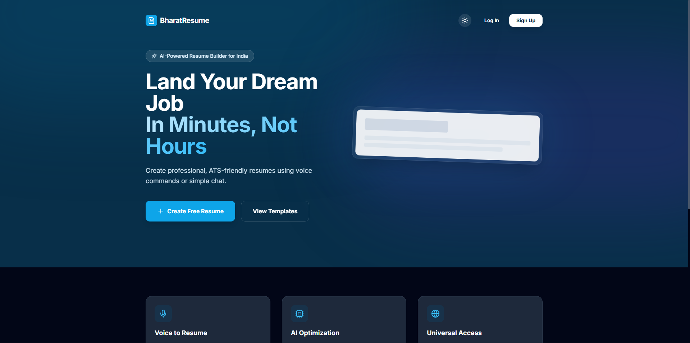
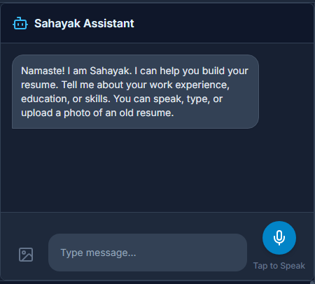
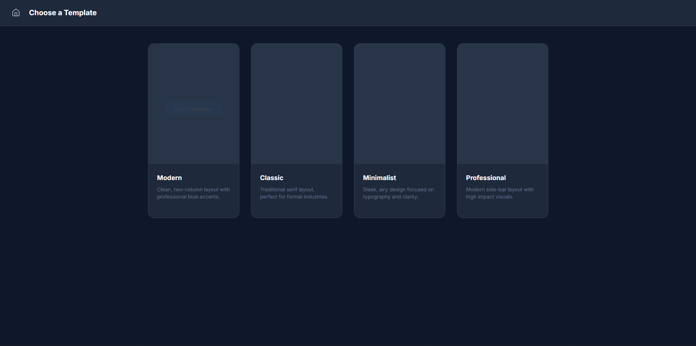
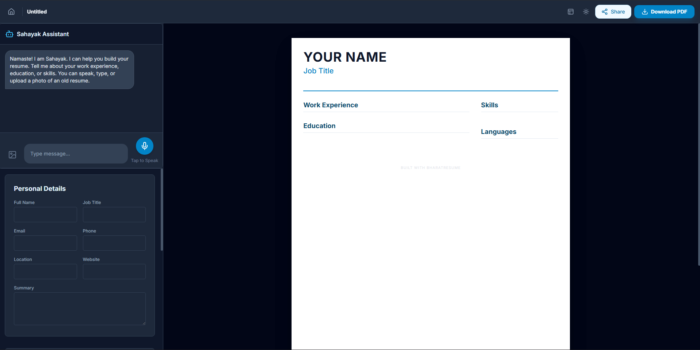

# 🚀 BharatResume: AI-Powered Universal Resume Builder

**BharatResume** is a production-ready, cloud-native SaaS application designed to help job seekers create professional, ATS-friendly resumes in minutes. Powered by advanced AI (Gemini/OpenAI), it supports voice commands, image extraction, and real-time template switching.

---

## ✨ Key Features

### 🤖 Intelligent AI Assistant ("Sahayak")
- **Dual AI Core**: Support for both Google Gemini 1.5 Flash and OpenAI GPT-4o-mini.
- **Voice-to-Resume**: Build your entire resume just by speaking (supports English and Hinglish).
- **Multimodal Extraction**: Upload a photo of an old resume, and the AI will extract all details automatically.
- **Smart Fallback**: Built-in regex parsing ensures functionality even when AI quotas are exceeded.

### 🎨 Professional Resume Templates
- **Modern**: Clean, two-column layout with professional blue accents.
- **Classic**: Traditional serif layout, ideal for formal and academic roles.
- **Minimalist**: Sleek design focused on typography and white space.
- **Professional**: High-impact side-bar layout for experienced professionals.
- **Real-time Switching**: Change templates instantly without losing your data.

### 🔐 Enterprise-Grade Security & UI
- **Secure Authentication**: Integrated Login/Signup system with user state management.
- **Privacy First**: Local storage persistence and secure API key handling via AWS Secrets Manager.
- **Smooth UX**: Optimized manual editor with zero-focus-loss typing.
- **PDF Export**: High-fidelity, A4-optimized PDF downloads.

---

## 📸 Screenshots

| Dashboard | AI Assistant ("Sahayak") |
| :---: | :---: |
|  |  |

| Template Selection | Editor & Preview |
| :---: | :---: |
|  |  |

---

## 🏗️ Cloud & DevOps Architecture (AWS)

This project is architected as a definitive showcase of **Senior Cloud & DevOps Architecture**, utilizing Infrastructure as Code (IaC) and automated delivery.

- **Infrastructure as Code**: Fully provisioned via **Terraform** (VPC, Subnets, NAT Gateways).
- **Container Orchestration**: **Amazon ECS on AWS Fargate** for serverless, scalable container management.
- **Global Delivery**: **Amazon CloudFront CDN** with **S3** origin for static asset edge-caching.
- **Security at Edge**: **AWS WAF** integrated with CloudFront for rate limiting and core rule protection (SQLi, XSS).
- **CI/CD Pipeline**: Enterprise **GitHub Actions** workflow for automated testing, Terraform provisioning, and zero-downtime ECS deployments.
- **Observability**: **CloudWatch Logs** aggregation for container health and application monitoring.

---

## 🛠️ Tech Stack

- **Frontend**: React 19, TypeScript, Tailwind CSS, Lucide Icons.
- **AI**: Google Gemini SDK, OpenAI SDK.
- **Cloud**: AWS (ECS, ECR, ALB, CloudFront, S3, Route53, WAF, Secrets Manager).
- **DevOps**: Docker, Terraform, GitHub Actions, Nginx.

---

## 🚀 Getting Started

### Local Development

1. **Clone the repository**:
   ```bash
   git clone https://github.com/pankajkumar077/AI-Resume-Builder.git
   cd AI-Resume-Builder
   ```

2. **Setup environment variables**:
   Create a `.env` file in the root:
   ```env
   VITE_GEMINI_API_KEY=your_gemini_api_key_here
   VITE_OPENAI_API_KEY=your_openai_api_key_here
   OPENAI_API_KEY=your_openai_api_key_here
   ```

   For local backend development, the server reads these values at runtime.

3. Run the backend server and frontend separately if needed:
   ```bash
   npm run dev:server
   npm run dev
   ```

3. **Install and Run**:
   ```bash
   npm install
   npm run dev
   ```

### Docker Deployment (Optional Local Test)
You do not have to deploy locally. This section is only for optional local validation.

```bash
docker-compose up --build
```

---

## 📄 Documentation
- [DevOps & Architecture Details](./DEVOPS_ARCHITECTURE.md)
- [Environment Configuration](./.env.example)

---

## 🤝 Contribution
Contributions are welcome! Please feel free to submit a Pull Request.

## ⚖️ License
This project is licensed under the MIT License.

---
*Developed with ❤️ as a showcase of Software Engineering and Cloud Excellence.*
